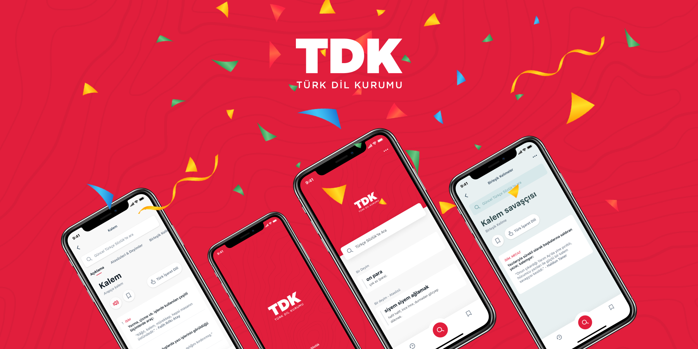

## Turkish Dictionary

Unofficial Turkish Dictionary app of [TDK (Turkish Language Association)](http://tdk.gov.tr/) developing with Flutter

#### Design

- [Feyza Nur Demirci](https://dribbble.com/feyzademirci)
- [Şahin Abut](https://dribbble.com/sahinabut)

#### Resources

- [Figma File](https://www.figma.com/file/JqpfJNo6eEJzPpTOEi3Irt/TDK-Redesign)  
- [Dribble](https://dribbble.com/shots/10736386-Turkish-Dictionary-Application)
